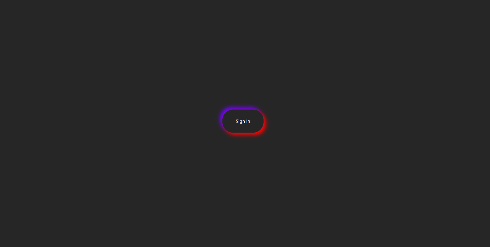

# phase-1-final-project

This is a web application that allows users to search meals by ingredients then it shows them the recipe of each meal and how to prepare it through a YouTube video.

## Live Page

https://khalid-zein.github.io/phase-1-final-project/

## installation

1. Open terminal(Ctrl+Alt+T)

2. git clone        

        git@github.com:khalid-zein/phase-1-final-project.git

3. 

        cd phase-1-final-project

4. code . or atom . depending on the text editor of your choice.

5. install json package 

        npm install -g json-server

6. run backend server in terminal 

        json-server --watch db.json

## Technologies Used

1. [HTML](https://)
2. [CSS](https://)
3. [Javascript](https://)
4. [Bootstrap](https://)
5. [jQuery](https://)

## Screenshot of live page

